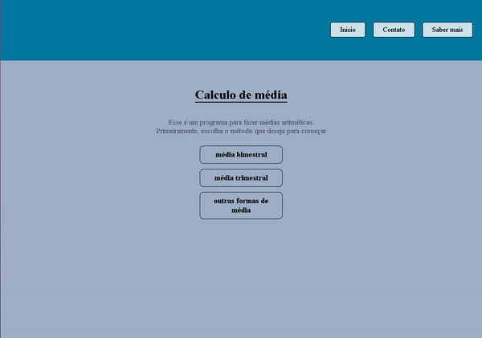
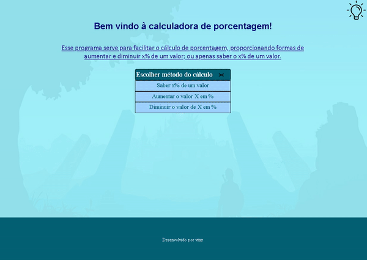
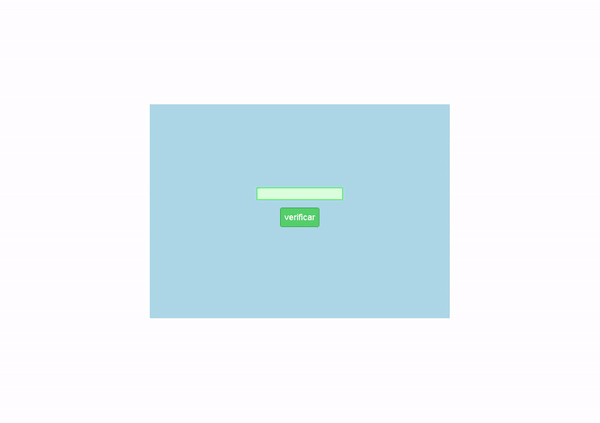
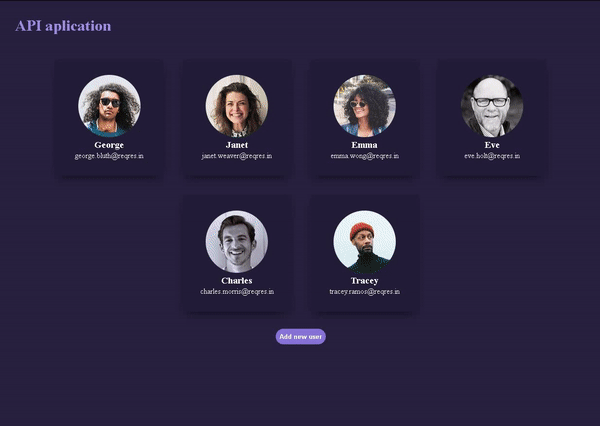
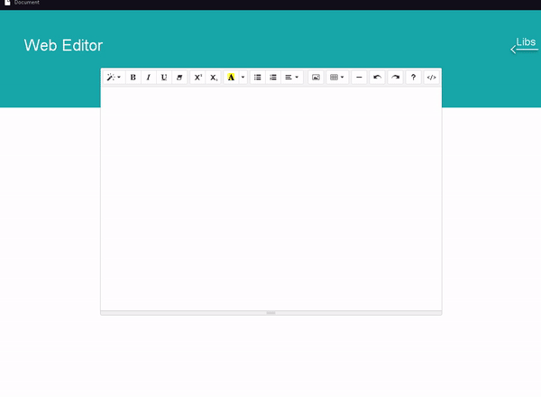

<h1 align="center">web-applications</h1>
<h2 align="center">Olá! Esse repositório consiste em agrupar vários projetos que fiz, para melhorar a organização e a vizualização deles. Irei ir atualizando conforme eu fazer novas coisas :).</h2>

 
 

<h3>&nbsp;&nbsp;&nbsp;&nbsp;&nbsp;&nbsp;&nbsp;&nbsp;&nbsp;&nbsp;&nbsp;1 - calculadora </h3>

Esse é um projeto que fiz com meu amigo. Basicamente, é uma calculadora, com suas funcionalidades básicas. Foi feito com html, css e javascript
 

  

<h3>&nbsp;&nbsp;&nbsp;&nbsp;&nbsp;&nbsp;&nbsp;&nbsp;&nbsp;&nbsp;&nbsp;2 - calculo de média </h3>

Esse projeto é uma simples aplicação front-end, que faz médias aritméticas. Foi feito com html, css e javascript.
 

  

<h3>&nbsp;&nbsp;&nbsp;&nbsp;&nbsp;&nbsp;&nbsp;&nbsp;&nbsp;&nbsp;&nbsp;3 - calculo de porcentagem </h3>

Esse projeto é uma simples aplicação front-end, servindo para calcular porcentagem. Foi feito com html, css e javascript
 

  

<h3>&nbsp;&nbsp;&nbsp;&nbsp;&nbsp;&nbsp;&nbsp;&nbsp;&nbsp;&nbsp;&nbsp;4 - verifica-cpf </h3>

Esse é projeto feito com o framework Flask, do Python. Voltado ao front-end, fiz uma aplicação que verifica o cpf, se ele é válido ou não no método de validar o cpf por meio da média ponderada (claro, não quer dizer todos cpf que passam pelo algoritmo são existentes, mas poderiam ser). Foi feito com html, css, e python (Flask)
 

  

<h3>&nbsp;&nbsp;&nbsp;&nbsp;&nbsp;&nbsp;&nbsp;&nbsp;&nbsp;&nbsp;&nbsp;5 - web-api </h3>

Esse é projeto feito com o framework Flask, do Python. Usando uma <a href="https://reqres.in">API</a>, que gera dados falsos, usados para praticar, fiz uma aplicação com os métodos http em python. Para armazanar os dados, fiz um arquivo .csv que guardasse os dados conforme fosse alterado, deletado ou criado um novo usuário. Foi feito com html, css, javascript e python (flask)
 

  

<h3>&nbsp;&nbsp;&nbsp;&nbsp;&nbsp;&nbsp;&nbsp;&nbsp;&nbsp;&nbsp;&nbsp;6 - web-editor </h3>

Nesse projeto, usei o <a href="https://summernote.org">summernote</a> e o <a href="https://www.npmjs.com/package/mammoth?activeTab=dependents">mammoth</a>, para fazer um editor de texto. O summernote usado para criar o editor, e o mammoth para converter docx para html, quando o usuário fizesse um upload. Foi feito com html, css e js (jquery) 
 

  

